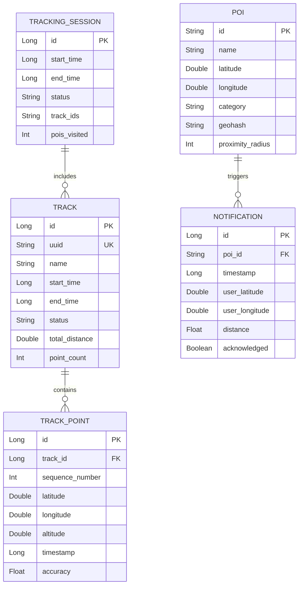

# Survey Me - Data Model Documentation

## 1. Overview

This document provides comprehensive specifications for all data structures, database schemas, data relationships, and data flow patterns used in the Survey Me application. It serves as the authoritative reference for data modeling decisions and implementation details.

### 1.1 Data Storage Strategy

The application employs a multi-tiered data storage strategy:

1. **Persistent Storage**: SQLite database via Room for structured data
2. **File Storage**: GPX files and exports in app-specific directories
3. **Cache Storage**: Temporary map tiles and computed data
4. **Memory Cache**: Runtime data structures for active sessions
5. **Shared Preferences**: User settings and app configuration

### 1.2 Data Principles

- **Offline-First**: All core data must be available offline
- **Data Integrity**: Foreign key constraints and validation rules
- **Privacy by Design**: No personal data without explicit consent
- **Efficient Queries**: Optimized indexes for common access patterns
- **Version Control**: Schema migrations for backward compatibility

## 2. Domain Models

### 2.1 Core Domain Entities

```kotlin
// Location domain model
data class Location(
    val latitude: Double,
    val longitude: Double,
    val altitude: Double? = null,
    val accuracy: Float? = null,
    val bearing: Float? = null,
    val speed: Float? = null,
    val time: Long = System.currentTimeMillis(),
    val provider: LocationProvider = LocationProvider.GPS
) {
    fun distanceTo(other: Location): Float {
        val results = FloatArray(1)
        android.location.Location.distanceBetween(
            latitude, longitude,
            other.latitude, other.longitude,
            results
        )
        return results[0]
    }

    fun toGeoPoint(): GeoPoint = GeoPoint(latitude, longitude, altitude ?: 0.0)
}

enum class LocationProvider {
    GPS,
    NETWORK,
    FUSED,
    MANUAL
}

// Track domain model
data class Track(
    val id: Long = 0,
    val uuid: String = UUID.randomUUID().toString(),
    val name: String,
    val description: String? = null,
    val startTime: Long,
    val endTime: Long? = null,
    val status: TrackStatus = TrackStatus.ACTIVE,
    val statistics: TrackStatistics? = null,
    val metadata: Map<String, String> = emptyMap()
) {
    val duration: Long
        get() = (endTime ?: System.currentTimeMillis()) - startTime

    val isActive: Boolean
        get() = status == TrackStatus.ACTIVE || status == TrackStatus.PAUSED
}

enum class TrackStatus {
    ACTIVE,
    PAUSED,
    COMPLETED,
    ABANDONED
}

data class TrackStatistics(
    val totalDistance: Double = 0.0,        // meters
    val totalDuration: Long = 0,            // milliseconds
    val averageSpeed: Double = 0.0,         // m/s
    val maxSpeed: Double = 0.0,             // m/s
    val minAltitude: Double? = null,        // meters
    val maxAltitude: Double? = null,        // meters
    val totalAscent: Double = 0.0,          // meters
    val totalDescent: Double = 0.0,         // meters
    val pointCount: Int = 0
)

// POI domain model
data class PointOfInterest(
    val id: String = UUID.randomUUID().toString(),
    val name: String,
    val description: String? = null,
    val location: Location,
    val category: PoiCategory,
    val tags: Map<String, String> = emptyMap(),
    val importance: PoiImportance = PoiImportance.NORMAL,
    val proximityRadius: Int = 50,          // meters
    val source: PoiSource,
    val createdAt: Long = System.currentTimeMillis(),
    val modifiedAt: Long = System.currentTimeMillis(),
    val customProperties: Map<String, Any> = emptyMap()
)

enum class PoiCategory(
    val displayName: String,
    val iconResource: Int,
    val colorResource: Int,
    val osmKey: String?
) {
    AMENITY("Amenity", R.drawable.ic_amenity, R.color.amenity, "amenity"),
    SHOP("Shop", R.drawable.ic_shop, R.color.shop, "shop"),
    TOURISM("Tourism", R.drawable.ic_tourism, R.color.tourism, "tourism"),
    TRANSPORT("Transport", R.drawable.ic_transport, R.color.transport, "public_transport"),
    NATURAL("Natural", R.drawable.ic_natural, R.color.natural, "natural"),
    HISTORIC("Historic", R.drawable.ic_historic, R.color.historic, "historic"),
    LEISURE("Leisure", R.drawable.ic_leisure, R.color.leisure, "leisure"),
    BUILDING("Building", R.drawable.ic_building, R.color.building, "building"),
    LANDUSE("Land Use", R.drawable.ic_landuse, R.color.landuse, "landuse"),
    CUSTOM("Custom", R.drawable.ic_custom, R.color.custom, null)
}

enum class PoiImportance {
    LOW,
    NORMAL,
    HIGH,
    CRITICAL
}

data class PoiSource(
    val type: SourceType,
    val identifier: String,
    val importedAt: Long = System.currentTimeMillis()
)

enum class SourceType {
    GPX_FILE,
    MANUAL_ENTRY,
    OSM_DOWNLOAD,
    IMPORT_SHARE,
    CLOUD_SYNC
}
```

### 2.2 User and Settings Models

```kotlin
// User preferences model
data class UserPreferences(
    val userId: String = "local_user",
    val trackingSettings: TrackingSettings,
    val notificationSettings: NotificationSettings,
    val mapSettings: MapSettings,
    val privacySettings: PrivacySettings,
    val uiSettings: UiSettings
)

data class TrackingSettings(
    val accuracyMode: AccuracyMode = AccuracyMode.HIGH,
    val updateInterval: Long = 5000,        // milliseconds
    val minDisplacement: Float = 2.0f,      // meters
    val backgroundTracking: Boolean = true,
    val autoPause: Boolean = true,
    val autoPauseSpeed: Float = 0.5f,       // m/s
    val keepScreenOn: Boolean = false
)

enum class AccuracyMode {
    HIGH,
    BALANCED,
    LOW_POWER
}

data class NotificationSettings(
    val poiProximityAlerts: Boolean = true,
    val defaultProximityRadius: Int = 50,   // meters
    val minTimeBetweenAlerts: Long = 60000, // milliseconds
    val alertSound: String? = null,
    val vibrationPattern: LongArray = longArrayOf(0, 200, 100, 200),
    val quietHours: QuietHours? = null,
    val categoryFilters: Set<PoiCategory> = PoiCategory.values().toSet()
)

data class QuietHours(
    val enabled: Boolean = false,
    val startTime: LocalTime,
    val endTime: LocalTime,
    val daysOfWeek: Set<DayOfWeek> = DayOfWeek.values().toSet()
)

data class MapSettings(
    val defaultMapStyle: MapStyle = MapStyle.STANDARD,
    val defaultZoomLevel: Float = 15f,
    val rotateWithCompass: Boolean = false,
    val showScaleBar: Boolean = true,
    val showCompass: Boolean = true,
    val showMyLocation: Boolean = true,
    val cacheSize: Long = 500 * 1024 * 1024, // bytes
    val offlineRegions: List<OfflineRegion> = emptyList()
)

enum class MapStyle {
    STANDARD,
    SATELLITE,
    TERRAIN,
    DARK,
    TRANSPORT,
    CYCLE
}

data class OfflineRegion(
    val id: String,
    val name: String,
    val bounds: BoundingBox,
    val minZoom: Int,
    val maxZoom: Int,
    val downloadedAt: Long,
    val sizeBytes: Long,
    val tileCount: Int
)
```

## 3. Database Schema

### 3.1 Room Database Entities

```kotlin
// Track entity
@Entity(
    tableName = "tracks",
    indices = [
        Index(value = ["status"]),
        Index(value = ["start_time"]),
        Index(value = ["uuid"], unique = true)
    ]
)
data class TrackEntity(
    @PrimaryKey(autoGenerate = true)
    @ColumnInfo(name = "id")
    val id: Long = 0,

    @ColumnInfo(name = "uuid")
    val uuid: String,

    @ColumnInfo(name = "name")
    val name: String,

    @ColumnInfo(name = "description")
    val description: String? = null,

    @ColumnInfo(name = "start_time")
    val startTime: Long,

    @ColumnInfo(name = "end_time")
    val endTime: Long? = null,

    @ColumnInfo(name = "status")
    val status: String,

    @ColumnInfo(name = "total_distance")
    val totalDistance: Double = 0.0,

    @ColumnInfo(name = "total_duration")
    val totalDuration: Long = 0,

    @ColumnInfo(name = "average_speed")
    val averageSpeed: Double = 0.0,

    @ColumnInfo(name = "max_speed")
    val maxSpeed: Double = 0.0,

    @ColumnInfo(name = "min_altitude")
    val minAltitude: Double? = null,

    @ColumnInfo(name = "max_altitude")
    val maxAltitude: Double? = null,

    @ColumnInfo(name = "total_ascent")
    val totalAscent: Double = 0.0,

    @ColumnInfo(name = "total_descent")
    val totalDescent: Double = 0.0,

    @ColumnInfo(name = "point_count")
    val pointCount: Int = 0,

    @ColumnInfo(name = "metadata")
    val metadata: String? = null, // JSON

    @ColumnInfo(name = "created_at")
    val createdAt: Long = System.currentTimeMillis(),

    @ColumnInfo(name = "updated_at")
    val updatedAt: Long = System.currentTimeMillis()
)

// Track point entity
@Entity(
    tableName = "track_points",
    foreignKeys = [
        ForeignKey(
            entity = TrackEntity::class,
            parentColumns = ["id"],
            childColumns = ["track_id"],
            onDelete = ForeignKey.CASCADE
        )
    ],
    indices = [
        Index(value = ["track_id"]),
        Index(value = ["track_id", "sequence_number"], unique = true),
        Index(value = ["timestamp"]),
        Index(value = ["latitude", "longitude"])
    ]
)
data class TrackPointEntity(
    @PrimaryKey(autoGenerate = true)
    @ColumnInfo(name = "id")
    val id: Long = 0,

    @ColumnInfo(name = "track_id")
    val trackId: Long,

    @ColumnInfo(name = "sequence_number")
    val sequenceNumber: Int,

    @ColumnInfo(name = "latitude")
    val latitude: Double,

    @ColumnInfo(name = "longitude")
    val longitude: Double,

    @ColumnInfo(name = "altitude")
    val altitude: Double? = null,

    @ColumnInfo(name = "timestamp")
    val timestamp: Long,

    @ColumnInfo(name = "accuracy")
    val accuracy: Float? = null,

    @ColumnInfo(name = "speed")
    val speed: Float? = null,

    @ColumnInfo(name = "bearing")
    val bearing: Float? = null,

    @ColumnInfo(name = "satellite_count")
    val satelliteCount: Int? = null,

    @ColumnInfo(name = "hdop")
    val hdop: Float? = null,

    @ColumnInfo(name = "vdop")
    val vdop: Float? = null,

    @ColumnInfo(name = "pdop")
    val pdop: Float? = null,

    @ColumnInfo(name = "provider")
    val provider: String? = null,

    @ColumnInfo(name = "battery_level")
    val batteryLevel: Float? = null,

    @ColumnInfo(name = "network_type")
    val networkType: String? = null
)

// POI entity
@Entity(
    tableName = "pois",
    indices = [
        Index(value = ["category"]),
        Index(value = ["geohash"]),
        Index(value = ["latitude", "longitude"]),
        Index(value = ["source_type", "source_identifier"])
    ]
)
data class PoiEntity(
    @PrimaryKey
    @ColumnInfo(name = "id")
    val id: String,

    @ColumnInfo(name = "name")
    val name: String,

    @ColumnInfo(name = "description")
    val description: String? = null,

    @ColumnInfo(name = "latitude")
    val latitude: Double,

    @ColumnInfo(name = "longitude")
    val longitude: Double,

    @ColumnInfo(name = "altitude")
    val altitude: Double? = null,

    @ColumnInfo(name = "geohash")
    val geohash: String,

    @ColumnInfo(name = "category")
    val category: String,

    @ColumnInfo(name = "tags")
    val tags: String? = null, // JSON

    @ColumnInfo(name = "importance")
    val importance: String = "NORMAL",

    @ColumnInfo(name = "proximity_radius")
    val proximityRadius: Int = 50,

    @ColumnInfo(name = "source_type")
    val sourceType: String,

    @ColumnInfo(name = "source_identifier")
    val sourceIdentifier: String,

    @ColumnInfo(name = "created_at")
    val createdAt: Long,

    @ColumnInfo(name = "updated_at")
    val updatedAt: Long,

    @ColumnInfo(name = "last_notified")
    val lastNotified: Long? = null,

    @ColumnInfo(name = "notification_count")
    val notificationCount: Int = 0,

    @ColumnInfo(name = "visited")
    val visited: Boolean = false,

    @ColumnInfo(name = "notes")
    val notes: String? = null,

    @ColumnInfo(name = "custom_properties")
    val customProperties: String? = null // JSON
)

// Notification entity
@Entity(
    tableName = "notifications",
    foreignKeys = [
        ForeignKey(
            entity = PoiEntity::class,
            parentColumns = ["id"],
            childColumns = ["poi_id"],
            onDelete = ForeignKey.CASCADE
        )
    ],
    indices = [
        Index(value = ["poi_id"]),
        Index(value = ["timestamp"]),
        Index(value = ["acknowledged"])
    ]
)
data class NotificationEntity(
    @PrimaryKey(autoGenerate = true)
    @ColumnInfo(name = "id")
    val id: Long = 0,

    @ColumnInfo(name = "poi_id")
    val poiId: String,

    @ColumnInfo(name = "timestamp")
    val timestamp: Long,

    @ColumnInfo(name = "user_latitude")
    val userLatitude: Double,

    @ColumnInfo(name = "user_longitude")
    val userLongitude: Double,

    @ColumnInfo(name = "distance")
    val distance: Float,

    @ColumnInfo(name = "acknowledged")
    val acknowledged: Boolean = false,

    @ColumnInfo(name = "acknowledged_at")
    val acknowledgedAt: Long? = null,

    @ColumnInfo(name = "action")
    val action: String? = null, // VIEWED, DISMISSED, SURVEYED, NAVIGATED

    @ColumnInfo(name = "tracking_session_id")
    val trackingSessionId: Long? = null
)

// Session entity for tracking sessions
@Entity(
    tableName = "tracking_sessions",
    indices = [
        Index(value = ["status"]),
        Index(value = ["start_time"])
    ]
)
data class TrackingSessionEntity(
    @PrimaryKey(autoGenerate = true)
    @ColumnInfo(name = "id")
    val id: Long = 0,

    @ColumnInfo(name = "start_time")
    val startTime: Long,

    @ColumnInfo(name = "end_time")
    val endTime: Long? = null,

    @ColumnInfo(name = "status")
    val status: String, // ACTIVE, COMPLETED, ABANDONED

    @ColumnInfo(name = "track_ids")
    val trackIds: String, // JSON array of track IDs

    @ColumnInfo(name = "total_distance")
    val totalDistance: Double = 0.0,

    @ColumnInfo(name = "total_duration")
    val totalDuration: Long = 0,

    @ColumnInfo(name = "pois_visited")
    val poisVisited: Int = 0,

    @ColumnInfo(name = "notifications_sent")
    val notificationsSent: Int = 0
)
```

### 3.2 Database Access Objects (DAOs)

```kotlin
@Dao
interface TrackDao {
    @Query("SELECT * FROM tracks ORDER BY start_time DESC")
    fun getAllTracks(): Flow<List<TrackEntity>>

    @Query("SELECT * FROM tracks WHERE id = :trackId")
    suspend fun getTrackById(trackId: Long): TrackEntity?

    @Query("SELECT * FROM tracks WHERE status = :status")
    fun getTracksByStatus(status: String): Flow<List<TrackEntity>>

    @Query("SELECT * FROM tracks WHERE start_time BETWEEN :startTime AND :endTime")
    suspend fun getTracksBetween(startTime: Long, endTime: Long): List<TrackEntity>

    @Insert
    suspend fun insertTrack(track: TrackEntity): Long

    @Update
    suspend fun updateTrack(track: TrackEntity)

    @Delete
    suspend fun deleteTrack(track: TrackEntity)

    @Query("DELETE FROM tracks WHERE id = :trackId")
    suspend fun deleteTrackById(trackId: Long)

    @Query("""
        UPDATE tracks
        SET total_distance = :distance,
            total_duration = :duration,
            average_speed = :avgSpeed,
            max_speed = :maxSpeed,
            point_count = :pointCount,
            updated_at = :updatedAt
        WHERE id = :trackId
    """)
    suspend fun updateTrackStatistics(
        trackId: Long,
        distance: Double,
        duration: Long,
        avgSpeed: Double,
        maxSpeed: Double,
        pointCount: Int,
        updatedAt: Long = System.currentTimeMillis()
    )
}

@Dao
interface TrackPointDao {
    @Query("SELECT * FROM track_points WHERE track_id = :trackId ORDER BY sequence_number")
    fun getPointsForTrack(trackId: Long): Flow<List<TrackPointEntity>>

    @Query("SELECT * FROM track_points WHERE track_id = :trackId ORDER BY sequence_number")
    suspend fun getPointsForTrackSync(trackId: Long): List<TrackPointEntity>

    @Query("""
        SELECT * FROM track_points
        WHERE track_id = :trackId
        AND sequence_number BETWEEN :startSeq AND :endSeq
        ORDER BY sequence_number
    """)
    suspend fun getPointRange(trackId: Long, startSeq: Int, endSeq: Int): List<TrackPointEntity>

    @Insert
    suspend fun insertPoint(point: TrackPointEntity): Long

    @Insert
    suspend fun insertPoints(points: List<TrackPointEntity>)

    @Query("DELETE FROM track_points WHERE track_id = :trackId")
    suspend fun deletePointsForTrack(trackId: Long)

    @Query("SELECT COUNT(*) FROM track_points WHERE track_id = :trackId")
    suspend fun getPointCount(trackId: Long): Int

    @Query("""
        SELECT MIN(latitude) as minLat, MAX(latitude) as maxLat,
               MIN(longitude) as minLon, MAX(longitude) as maxLon
        FROM track_points WHERE track_id = :trackId
    """)
    suspend fun getBounds(trackId: Long): TrackBounds?
}

data class TrackBounds(
    val minLat: Double,
    val maxLat: Double,
    val minLon: Double,
    val maxLon: Double
)

@Dao
interface PoiDao {
    @Query("SELECT * FROM pois")
    fun getAllPois(): Flow<List<PoiEntity>>

    @Query("SELECT * FROM pois WHERE id = :poiId")
    suspend fun getPoiById(poiId: String): PoiEntity?

    @Query("SELECT * FROM pois WHERE category = :category")
    fun getPoisByCategory(category: String): Flow<List<PoiEntity>>

    @Query("""
        SELECT * FROM pois
        WHERE latitude BETWEEN :minLat AND :maxLat
        AND longitude BETWEEN :minLon AND :maxLon
    """)
    suspend fun getPoisInBounds(
        minLat: Double,
        maxLat: Double,
        minLon: Double,
        maxLon: Double
    ): List<PoiEntity>

    @Query("""
        SELECT * FROM pois
        WHERE geohash LIKE :geohashPrefix || '%'
    """)
    suspend fun getPoisByGeohashPrefix(geohashPrefix: String): List<PoiEntity>

    @Insert(onConflict = OnConflictStrategy.REPLACE)
    suspend fun insertPoi(poi: PoiEntity)

    @Insert(onConflict = OnConflictStrategy.REPLACE)
    suspend fun insertPois(pois: List<PoiEntity>)

    @Update
    suspend fun updatePoi(poi: PoiEntity)

    @Delete
    suspend fun deletePoi(poi: PoiEntity)

    @Query("DELETE FROM pois WHERE source_identifier = :sourceId")
    suspend fun deletePoiBySource(sourceId: String)

    @Query("""
        UPDATE pois
        SET last_notified = :timestamp,
            notification_count = notification_count + 1
        WHERE id = :poiId
    """)
    suspend fun updateNotificationInfo(poiId: String, timestamp: Long)

    @Query("UPDATE pois SET visited = :visited WHERE id = :poiId")
    suspend fun markAsVisited(poiId: String, visited: Boolean = true)
}
```

### 3.3 Type Converters

```kotlin
@TypeConverters
class DatabaseConverters {
    private val gson = Gson()

    @TypeConverter
    fun fromStringMap(value: String?): Map<String, String>? {
        if (value == null) return null
        val type = object : TypeToken<Map<String, String>>() {}.type
        return gson.fromJson(value, type)
    }

    @TypeConverter
    fun fromMapString(map: Map<String, String>?): String? {
        return map?.let { gson.toJson(it) }
    }

    @TypeConverter
    fun fromStringList(value: String?): List<String>? {
        if (value == null) return null
        val type = object : TypeToken<List<String>>() {}.type
        return gson.fromJson(value, type)
    }

    @TypeConverter
    fun fromListString(list: List<String>?): String? {
        return list?.let { gson.toJson(it) }
    }

    @TypeConverter
    fun fromLocalTime(time: LocalTime?): String? {
        return time?.toString()
    }

    @TypeConverter
    fun toLocalTime(timeString: String?): LocalTime? {
        return timeString?.let { LocalTime.parse(it) }
    }

    @TypeConverter
    fun fromDayOfWeekSet(days: Set<DayOfWeek>?): String? {
        return days?.joinToString(",") { it.name }
    }

    @TypeConverter
    fun toDayOfWeekSet(daysString: String?): Set<DayOfWeek>? {
        return daysString?.split(",")?.map { DayOfWeek.valueOf(it) }?.toSet()
    }
}
```

## 4. Data Relationships

### 4.1 Entity Relationship Diagram



### 4.2 Data Flow Patterns

```kotlin
// Repository pattern implementation
class TrackRepository(
    private val trackDao: TrackDao,
    private val trackPointDao: TrackPointDao,
    private val ioDispatcher: CoroutineDispatcher = Dispatchers.IO
) {
    fun getAllTracks(): Flow<List<Track>> = trackDao.getAllTracks()
        .map { entities ->
            entities.map { it.toDomainModel() }
        }
        .flowOn(ioDispatcher)

    suspend fun createTrack(name: String, description: String? = null): Track {
        return withContext(ioDispatcher) {
            val entity = TrackEntity(
                uuid = UUID.randomUUID().toString(),
                name = name,
                description = description,
                startTime = System.currentTimeMillis(),
                status = TrackStatus.ACTIVE.name
            )
            val id = trackDao.insertTrack(entity)
            entity.copy(id = id).toDomainModel()
        }
    }

    suspend fun addTrackPoint(trackId: Long, location: Location) {
        withContext(ioDispatcher) {
            val pointCount = trackPointDao.getPointCount(trackId)
            val point = TrackPointEntity(
                trackId = trackId,
                sequenceNumber = pointCount + 1,
                latitude = location.latitude,
                longitude = location.longitude,
                altitude = location.altitude,
                timestamp = location.time,
                accuracy = location.accuracy,
                speed = location.speed,
                bearing = location.bearing,
                provider = location.provider.name
            )
            trackPointDao.insertPoint(point)

            // Update track statistics
            updateTrackStatistics(trackId)
        }
    }

    private suspend fun updateTrackStatistics(trackId: Long) {
        val points = trackPointDao.getPointsForTrackSync(trackId)
        if (points.isEmpty()) return

        var totalDistance = 0.0
        var maxSpeed = 0.0
        var minAltitude = Double.MAX_VALUE
        var maxAltitude = Double.MIN_VALUE

        for (i in 1 until points.size) {
            val prev = points[i - 1]
            val curr = points[i]

            // Calculate distance
            val distance = calculateDistance(
                prev.latitude, prev.longitude,
                curr.latitude, curr.longitude
            )
            totalDistance += distance

            // Update speed
            curr.speed?.let { speed ->
                if (speed > maxSpeed) maxSpeed = speed.toDouble()
            }

            // Update altitude
            curr.altitude?.let { alt ->
                if (alt < minAltitude) minAltitude = alt
                if (alt > maxAltitude) maxAltitude = alt
            }
        }

        val duration = points.last().timestamp - points.first().timestamp
        val avgSpeed = if (duration > 0) totalDistance / (duration / 1000.0) else 0.0

        trackDao.updateTrackStatistics(
            trackId = trackId,
            distance = totalDistance,
            duration = duration,
            avgSpeed = avgSpeed,
            maxSpeed = maxSpeed,
            pointCount = points.size
        )
    }
}
```

## 5. Data Migration Strategies

### 5.1 Database Migrations

```kotlin
object DatabaseMigrations {
    val MIGRATION_1_2 = object : Migration(1, 2) {
        override fun migrate(database: SupportSQLiteDatabase) {
            // Add geohash column to POIs table
            database.execSQL("""
                ALTER TABLE pois ADD COLUMN geohash TEXT NOT NULL DEFAULT ''
            """)

            // Calculate geohash for existing POIs
            val cursor = database.query("SELECT id, latitude, longitude FROM pois")
            while (cursor.moveToNext()) {
                val id = cursor.getString(0)
                val lat = cursor.getDouble(1)
                val lon = cursor.getDouble(2)
                val geohash = calculateGeohash(lat, lon, 7)

                database.execSQL("""
                    UPDATE pois SET geohash = ? WHERE id = ?
                """, arrayOf(geohash, id))
            }
            cursor.close()

            // Create index on geohash
            database.execSQL("""
                CREATE INDEX idx_pois_geohash ON pois(geohash)
            """)
        }
    }

    val MIGRATION_2_3 = object : Migration(2, 3) {
        override fun migrate(database: SupportSQLiteDatabase) {
            // Add tracking sessions table
            database.execSQL("""
                CREATE TABLE IF NOT EXISTS tracking_sessions (
                    id INTEGER PRIMARY KEY AUTOINCREMENT NOT NULL,
                    start_time INTEGER NOT NULL,
                    end_time INTEGER,
                    status TEXT NOT NULL,
                    track_ids TEXT NOT NULL,
                    total_distance REAL NOT NULL DEFAULT 0.0,
                    total_duration INTEGER NOT NULL DEFAULT 0,
                    pois_visited INTEGER NOT NULL DEFAULT 0,
                    notifications_sent INTEGER NOT NULL DEFAULT 0
                )
            """)

            // Add session reference to notifications
            database.execSQL("""
                ALTER TABLE notifications
                ADD COLUMN tracking_session_id INTEGER
                REFERENCES tracking_sessions(id)
            """)
        }
    }
}
```

### 5.2 Data Export/Import

```kotlin
// GPX export implementation
class GpxExporter {
    fun exportTrack(track: Track, points: List<TrackPoint>): String {
        val builder = StringBuilder()
        builder.append("""<?xml version="1.0" encoding="UTF-8"?>""")
        builder.append("""
            <gpx version="1.1" creator="SurveyMe"
                 xmlns="http://www.topografix.com/GPX/1/1"
                 xmlns:xsi="http://www.w3.org/2001/XMLSchema-instance"
                 xsi:schemaLocation="http://www.topografix.com/GPX/1/1
                                     http://www.topografix.com/GPX/1/1/gpx.xsd">
        """.trimIndent())

        // Add metadata
        builder.append("<metadata>")
        builder.append("<name>${escapeXml(track.name)}</name>")
        track.description?.let {
            builder.append("<desc>${escapeXml(it)}</desc>")
        }
        builder.append("<time>${formatIso8601(track.startTime)}</time>")
        builder.append("</metadata>")

        // Add track
        builder.append("<trk>")
        builder.append("<name>${escapeXml(track.name)}</name>")
        builder.append("<trkseg>")

        for (point in points) {
            builder.append("""
                <trkpt lat="${point.latitude}" lon="${point.longitude}">
            """.trimIndent())

            point.altitude?.let {
                builder.append("<ele>$it</ele>")
            }
            builder.append("<time>${formatIso8601(point.timestamp)}</time>")

            // Add extensions
            builder.append("<extensions>")
            point.accuracy?.let {
                builder.append("<accuracy>$it</accuracy>")
            }
            point.speed?.let {
                builder.append("<speed>$it</speed>")
            }
            point.bearing?.let {
                builder.append("<bearing>$it</bearing>")
            }
            builder.append("</extensions>")

            builder.append("</trkpt>")
        }

        builder.append("</trkseg>")
        builder.append("</trk>")
        builder.append("</gpx>")

        return builder.toString()
    }
}

// JSON export for backups
class JsonExporter {
    private val gson = GsonBuilder()
        .setPrettyPrinting()
        .setDateFormat("yyyy-MM-dd'T'HH:mm:ss.SSS'Z'")
        .create()

    fun exportDatabase(
        tracks: List<Track>,
        pois: List<PointOfInterest>,
        settings: UserPreferences
    ): String {
        val backup = DatabaseBackup(
            version = 1,
            exportedAt = System.currentTimeMillis(),
            tracks = tracks,
            pois = pois,
            settings = settings
        )
        return gson.toJson(backup)
    }
}

data class DatabaseBackup(
    val version: Int,
    val exportedAt: Long,
    val tracks: List<Track>,
    val pois: List<PointOfInterest>,
    val settings: UserPreferences
)
```

## 6. Data Validation

### 6.1 Validation Rules

```kotlin
object DataValidation {
    fun validateLocation(location: Location): ValidationResult {
        val errors = mutableListOf<String>()

        if (location.latitude !in -90.0..90.0) {
            errors.add("Latitude must be between -90 and 90")
        }

        if (location.longitude !in -180.0..180.0) {
            errors.add("Longitude must be between -180 and 180")
        }

        location.altitude?.let { alt ->
            if (alt < -500 || alt > 9000) {
                errors.add("Altitude seems unrealistic: $alt")
            }
        }

        location.accuracy?.let { acc ->
            if (acc < 0 || acc > 1000) {
                errors.add("Accuracy out of expected range: $acc")
            }
        }

        location.speed?.let { speed ->
            if (speed < 0 || speed > 100) { // 360 km/h
                errors.add("Speed seems unrealistic: $speed m/s")
            }
        }

        return if (errors.isEmpty()) {
            ValidationResult.Success
        } else {
            ValidationResult.Error(errors)
        }
    }

    fun validatePoi(poi: PointOfInterest): ValidationResult {
        val errors = mutableListOf<String>()

        if (poi.name.isBlank()) {
            errors.add("POI name cannot be empty")
        }

        if (poi.name.length > 100) {
            errors.add("POI name too long (max 100 characters)")
        }

        if (poi.proximityRadius !in 10..1000) {
            errors.add("Proximity radius must be between 10 and 1000 meters")
        }

        validateLocation(poi.location).let { result ->
            if (result is ValidationResult.Error) {
                errors.addAll(result.errors)
            }
        }

        return if (errors.isEmpty()) {
            ValidationResult.Success
        } else {
            ValidationResult.Error(errors)
        }
    }
}

sealed class ValidationResult {
    object Success : ValidationResult()
    data class Error(val errors: List<String>) : ValidationResult()
}
```

## 7. Data Synchronization

### 7.1 Conflict Resolution

```kotlin
class SyncManager {
    enum class ConflictResolution {
        LOCAL_WINS,
        REMOTE_WINS,
        MERGE,
        ASK_USER
    }

    fun resolvePoiConflict(
        local: PointOfInterest,
        remote: PointOfInterest,
        strategy: ConflictResolution = ConflictResolution.MERGE
    ): PointOfInterest {
        return when (strategy) {
            ConflictResolution.LOCAL_WINS -> local
            ConflictResolution.REMOTE_WINS -> remote
            ConflictResolution.MERGE -> {
                // Merge strategy: take newest data for each field
                PointOfInterest(
                    id = local.id,
                    name = if (local.modifiedAt > remote.modifiedAt) local.name else remote.name,
                    description = if (local.modifiedAt > remote.modifiedAt) local.description else remote.description,
                    location = if (local.modifiedAt > remote.modifiedAt) local.location else remote.location,
                    category = if (local.modifiedAt > remote.modifiedAt) local.category else remote.category,
                    tags = local.tags + remote.tags, // Merge tags
                    importance = maxOf(local.importance, remote.importance),
                    proximityRadius = minOf(local.proximityRadius, remote.proximityRadius),
                    source = local.source,
                    createdAt = minOf(local.createdAt, remote.createdAt),
                    modifiedAt = maxOf(local.modifiedAt, remote.modifiedAt),
                    customProperties = local.customProperties + remote.customProperties
                )
            }
            ConflictResolution.ASK_USER -> {
                // Would trigger UI dialog
                throw UserInterventionRequired(local, remote)
            }
        }
    }
}
```

## 8. Data Caching Strategy

### 8.1 Memory Cache

```kotlin
class MemoryCache<K, V>(
    private val maxSize: Int = 100
) {
    private val cache = LinkedHashMap<K, V>(
        initialCapacity = maxSize,
        loadFactor = 0.75f,
        accessOrder = true // LRU ordering
    )

    @Synchronized
    fun get(key: K): V? = cache[key]

    @Synchronized
    fun put(key: K, value: V) {
        cache[key] = value
        if (cache.size > maxSize) {
            val iterator = cache.entries.iterator()
            iterator.next()
            iterator.remove()
        }
    }

    @Synchronized
    fun clear() = cache.clear()
}

// Usage in repository
class CachedPoiRepository(
    private val poiDao: PoiDao
) {
    private val cache = MemoryCache<String, PointOfInterest>(500)

    suspend fun getPoiById(id: String): PointOfInterest? {
        // Check cache first
        cache.get(id)?.let { return it }

        // Load from database
        val poi = poiDao.getPoiById(id)?.toDomainModel()

        // Update cache
        poi?.let { cache.put(id, it) }

        return poi
    }
}
```

## 9. Data Analytics Models

### 9.1 Analytics Events

```kotlin
sealed class AnalyticsEvent {
    data class TrackingStarted(
        val timestamp: Long,
        val accuracyMode: AccuracyMode
    ) : AnalyticsEvent()

    data class TrackingCompleted(
        val duration: Long,
        val distance: Double,
        val pointCount: Int
    ) : AnalyticsEvent()

    data class PoiProximity(
        val poiId: String,
        val category: PoiCategory,
        val distance: Float,
        val notificationShown: Boolean
    ) : AnalyticsEvent()

    data class MapInteraction(
        val action: MapAction,
        val zoomLevel: Float,
        val centerLat: Double,
        val centerLon: Double
    ) : AnalyticsEvent()
}

enum class MapAction {
    PAN, ZOOM_IN, ZOOM_OUT, ROTATE, LAYER_CHANGE, POI_TAP
}
```

---

*This data model documentation defines all data structures, relationships, and operations for the Survey Me application. It should be maintained and updated as the application evolves.*